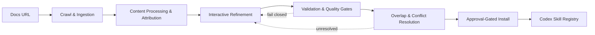
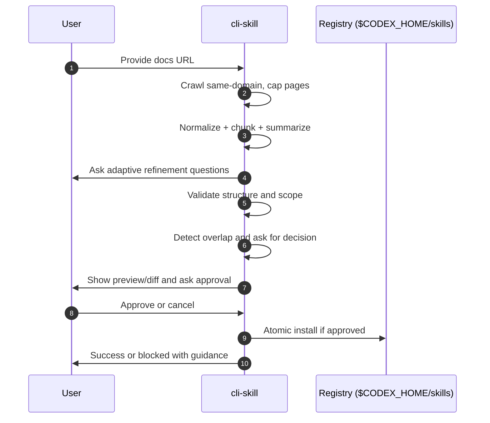

# Skill Weaver (cli-skill)

A cyberpunk-grade CLI for forging Codex skills from a single docs URL. Drop a link into the grid, trace the signal across the domain, and walk out with a validated, conflict-checked skill installed only after explicit approval.

**What It Is**
Skill Weaver is a Go CLI that turns documentation into a Codex skill scaffold through an adaptive, quality-gated flow. The pipeline is local-first, fail-closed, and engineered to keep every skill atomic, auditable, and immediately usable.

**Why It Exists**
- One-page links are easy; usable Codex skills are not. Skill Weaver bridges that gap with structured refinement and strict validation.
- Skill overlap is costly. The tool detects conflicts and forces explicit resolution before anything is written.
- Installation safety matters. No writes happen before preview and approval.

**Core Principles**
- Local-first pipeline with deterministic output boundaries.
- Fail-closed validation and conflict gates.
- Explicit approval before any filesystem mutation.
- Single-capability skills with explicit in-scope and out-of-scope boundaries.
- Bounded, same-domain crawl starting from a single entry URL.

**Architecture At A Glance**


**Phase Map**
Phase 1: Crawl & Ingestion Foundation
- Same-domain crawl only, default cap 50 pages, transparent skip reasons, summary counts.

Phase 2: Content Processing & Attribution
- Normalize text, preserve structure, chunk and summarize with per-chunk source attribution.

Phase 3: Interactive Refinement Loop
- Adaptive question flow, confidence-driven deepening, `revise <field>` edits, sectioned review.

Phase 4: Validation & Quality Gates
- Structural and semantic validation, one-issue-at-a-time fix loop, explicit scope boundaries.

Phase 5: Overlap & Conflict Resolution
- Detect overlap with installed skills and require explicit update/merge/abort decision.

Phase 6: Approval-Gated Install & Activation
- Preview/diff, explicit approval, atomic install, post-install verification.

**Dataflow Contract**


**Tech Stack**
Core CLI dependencies (pinned):
- Go `1.25.x`
- `github.com/spf13/cobra@v1.10.2`
- `charm.land/huh/v2@v2.0.3`
- `github.com/openai/openai-go/v3@v3.26.0`
- `github.com/spf13/viper@v1.21.0`

Phase stacks (planned, per research docs):
- Crawl foundation: `github.com/gocolly/colly/v2`, `net/url`, `mime`, `github.com/PuerkitoBio/goquery`
- Content processing: `codeberg.org/readeck/go-readability/v2`, `github.com/JohannesKaufmann/html-to-markdown/v2`, `github.com/tmc/langchaingo/textsplitter`, `github.com/pkoukk/tiktoken-go`
- Refinement loop: `github.com/santhosh-tekuri/jsonschema/v6`, optional `github.com/looplab/fsm`
- Validation gates: `github.com/yuin/goldmark`, `go.abhg.dev/goldmark/frontmatter`, `github.com/go-playground/validator/v10`
- Overlap resolution: `github.com/google/go-cmp`, `github.com/sergi/go-diff`
- Install pipeline: `github.com/spf13/afero` (tests), `github.com/sergi/go-diff`, stdlib atomic rename

**Repository Layout**
Current entrypoint:
- `cmd/cli-skill/` is the main package for the CLI binary.

Current internal packages:
- `internal/crawl/` includes crawl contracts and skip-reason taxonomy.

Planned internal packages (phase-aligned):
- `internal/content/` for extraction, normalization, chunking, summarization, presentation.
- `internal/refinement/` for adaptive questioning and revision flow.
- `internal/validation/` for schema and semantic validation gates.
- `internal/overlap/` for installed-skill indexing and conflict decisions.
- `internal/install/` for preview, approval, and atomic install transaction.

**How The Build Is Shaped**
1. Start with a single docs URL.
2. Crawl same-domain pages with a strict cap and explicit skip reasons.
3. Extract and normalize content with structure preserved.
4. Chunk and summarize content with per-chunk attribution.
5. Run an adaptive question flow to fill required skill fields.
6. Validate structure and scope; fix one blocking issue at a time.
7. Detect overlap with installed skills and require explicit decision.
8. Show preview/diff, require approval, install atomically.

**Getting Started**
Prerequisites:
- Go `1.25.x` installed and on `PATH`.
- `CODEX_HOME` set to your Codex home directory.

Initialize and run:
```bash
go mod init <module-path>
go get github.com/spf13/cobra@v1.10.2
go get charm.land/huh/v2@v2.0.3
go get github.com/openai/openai-go/v3@v3.26.0
go get github.com/spf13/viper@v1.21.0

go mod tidy
go fmt ./...
go vet ./...
go test ./...

go run ./cmd/cli-skill --help
```

Build and install:
```bash
go build -o bin/cli-skill ./cmd/cli-skill
./bin/cli-skill --version

go install ./cmd/cli-skill
```

**Current Status**
- Phase 1 is in progress.
- Task 1 for Phase 1 Plan 01-01 is implemented.
- Verification for that task is pending.
- Roadmap coverage is complete for all v1 requirements.

**Useful If You Want**
- A deterministic, local-first path from docs to a Codex-ready skill.
- Strict safety gates and explicit approvals before install.
- A pipeline that surfaces what it skips, why it skips, and how it decides.

**Notes**
- The binary name is `cli-skill` per project instructions.
- The project name in planning docs is Skill Weaver; both refer to the same tool.
- The pipeline is intentionally bounded in v1 to keep outputs deterministic and audit-friendly.
